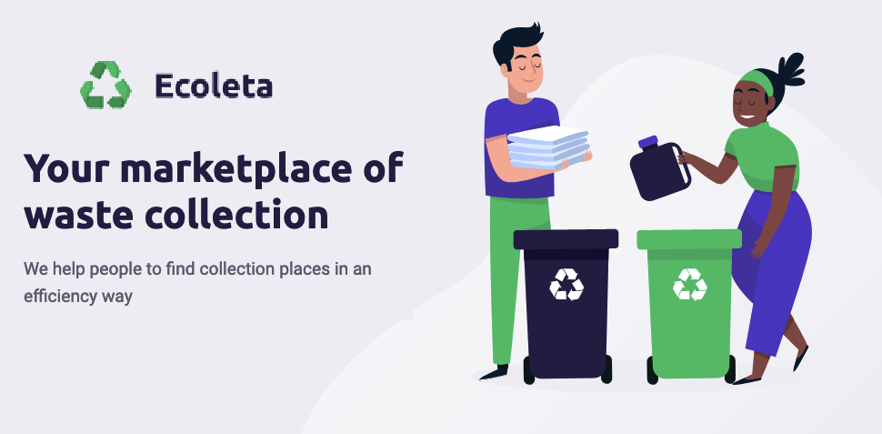
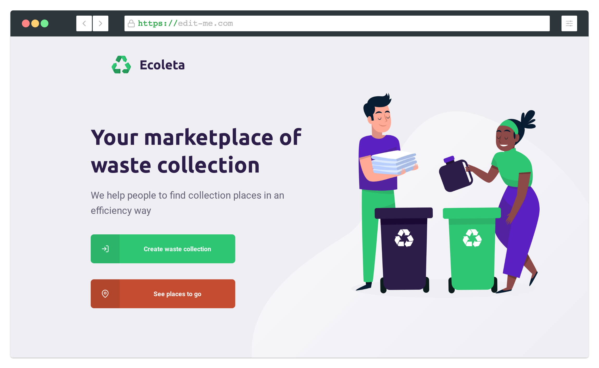

<h1 align=center>
  
</h1>

<div align="center">

![GitHub][repository_license_badge] ![Node_Badge][node_version_badge] ![Npm_Badge][npm_version_badge] ![React_Badge][web_react_badge] ![React_Native_Badge][mobile_react-native_badge] ![NodeJS_Badge][server_nodejs_badge] [](https://github.com/ellerbrock/typescript-badges/)

</div>

<h3 align="center">

♻️ Ecoleta is a **Open Source** project developed during the week **Next Level Week (1.0)** by **[Rocketseat] [rocketseat_site]** using **TypeScript, Node, React and React Native technologies** .

</h3>

## **:rocket: Goal**

The project aims to **establish a connection** between **companies and / or entities that collect waste** (organic and inorganic) **to people and / or entities that constantly need to dispatch of their waste**. Solving a major recurring problem that is **inappropriate waste disposal**, facilitating the recycling and reuse process.





## **:computer: Techs**


#### **Website** ([React][react] + [TypeScript][typescript])

  - **[React Router Dom][react_router_dom]**
  - **[React Icons][react_icons]**
  - **[Axios][axios]**
  - **[Leaflet][leaflet]**
  - **[React Leaflet][react_leaflet]**
  - **[React Dropzone][react_dropzone]**


#### **Server** ([NodeJS][node] + [TypeScript][typescript])

  - **[Express][express]**
  - **[CORS][cors]**
  - **[KnexJS][knex]**
  - **[SQLite][sqlite3]**
  - **[ts-node][tsnode]**
  - **[dotENV][dotenv]**
  - **[Multer][multer]**
  - **[Celebrate][celebrate]**
  - **[Joi][joi]**

#### **Mobile** ([React Native][react_native] + [TypeScript][typescript])

  - **[Expo][expo]**
  - **[Expo Google Fonts][expo_google_fonts]**
  - **[React Navigation][react_navigation]**
  - **[React Native Maps][react_native_maps]**
  - **[Expo Constants][expo_constants]**
  - **[React Native SVG][react_native_svg]**
  - **[Axios][axios]**
  - **[Expo Location][expo_location]**
  - **[Expo Mail Composer][expo_mail_composer]**


## **:wine_glass: How to use**

### Firsts setups

First, you need to have <kbd> [NodeJS](https://nodejs.org/en/download/) </kbd> installed on your machine.

You can also choose to use **yarn** instead of **npm**. You can install by clicking on this <kbd> [link][yarn] </kbd>

After **Node** be installed, install **React and React Native (Expo)** dependencies globally, using the commands:

```sh
# React:
$ npm install create-react-app -g

# Expo (React Native):
$ npm install -g expo-cli
```

Install the dependencies contained in the `package.json` files located at the root of the repository (for managing commits), in the **server** directory, in the **website** directory and in the **mobile** directory. To install the dependencies, just open the terminal in the directory and type the command:

```sh
$ yarn
```

examples:
```sh

# Install dependencies of the backend:
$ cd ./backend
$ yarn

# Install dependencies of website:
$ cd ./frontend
$ yarn

# Install dependencies of mobile:
$ cd ./mobile
$ yarn
```

### Using the backend

```sh
# Go to folder
$ cd ./backend

# Create DB:
$ npx knex migrate:latest

# Add default elements into DB (seeds):
$ npx knex seed:run

# Execute in dev/development environment
$ npm run dev
```

### Using WEB

```sh
# Go to folder:
$ cd ./frontend

# Execute in dev environment
$ yarn start
```

> If a browser does not open automatically, type: http://localhost:3000 in the URL.


### Using mobile

Install <kbd>[Expo app](https://play.google.com/store/apps/details?id=host.exp.exponent&hl=en)</kbd> in your phone.

```sh
# Go to folder:
$ cd ./mobile

# Execute in dev environment:
$ npm run start
```
Now open the app expo e **LAN** mode e scan the QRCode

## **:star2: Special thanks to**

<div align=center>

<table style="width:100%">
  <tr align=center>
    <th><strong>Next Level Week</strong></th>
    <th><strong>Rocketseat</strong></th>
    <th><strong>diego3g</strong></th>
    <th><strong>maykbrito</strong></th>
  </tr>
  <tr align=center>
    <td>
      <a href="https://nextlevelweek.com/">
        
      </a>
    </td>
    <td>
      <a href="https://rocketseat.com.br/">
        
      </a>
    </td>
    <td>
      <a href="https://github.com/diego3g">
        
      </a>
    </td>
    <td>
      <a href="https://github.com/maykbrito">
        
      </a>
    </td>
  </tr>
</table>

</div>

## **:books: References**

- [React + TypeScript Cheat Sheet](https://github.com/typescript-cheatsheets/react-typescript-cheatsheet)
- [Blog Rocketseat](https://blog.rocketseat.com.br/)
- [ReactJS](https://reactjs.org/docs/getting-started.html) | [ReactJS pt-BR](https://pt-br.reactjs.org/docs/getting-started.html)
- [TypeScript](https://www.typescriptlang.org/docs/home.html)
- [React Native](https://reactnative.dev/docs/getting-started)
- [Expo](https://expo.io/learn)
- [Knex][knex]
- [Express](https://expressjs.com/pt-br/)
- [Node](https://nodejs.org/en/)
- [Celebrate](https://github.com/arb/celebrate)
- [Joi](https://hapi.dev/module/joi/)

## **:page_with_curl: Licence**

**MIT LICENSE**. [LICENSE](./LICENSE)

<h2 align="center">Feito com ❤️ por <a href="https://www.linkedin.com/in/luizhenriquefbb/">Luiz Barros</a></h2>

<!-- Website Links -->

[rocketseat_site]: https://rocketseat.com.br/

<!-- Badges -->

[repository_license_badge]: https://img.shields.io/github/license/x0n4d0/ecoleta

[node_version_badge]: https://img.shields.io/badge/node-12.17.0-green

[npm_version_badge]: https://img.shields.io/badge/npm-6.14.4-red

[web_react_badge]: https://img.shields.io/badge/web-react-blue

[mobile_react-native_badge]: https://img.shields.io/badge/mobile-react%20native-blueviolet

[server_nodejs_badge]: https://img.shields.io/badge/backend-nodejs-important

<!-- Techs -->

[react]: https://reactjs.org/

[typescript]: https://www.typescriptlang.org/

[node]: https://nodejs.org/en/

[leaflet]: https://react-leaflet.js.org/en/

[ibge_api]: https://servicodados.ibge.gov.br/api/docs/localidades?versao=1

[ibge_api_ufs]: https://servicodados.ibge.gov.br/api/docs/localidades?versao=1#api-UFs-estadosGet

[ibge_api_municipios]: https://servicodados.ibge.gov.br/api/docs/localidades?versao=1#api-Municipios-estadosUFMunicipiosGet

[vscode]: https://code.visualstudio.com/

[react_native]: http://www.reactnative.com/

[stackedit]: https://stackedit.io

[vscode_sqlite_extension]: https://marketplace.visualstudio.com/items?itemName=alexcvzz.vscode-sqlite

[markdown_emoji]: https://gist.github.com/rxaviers/7360908

[commitlint]: https://github.com/conventional-changelog/commitlint

[express]: https://expressjs.com/

[cors]: https://expressjs.com/en/resources/middleware/cors.html

[knex]: http://knexjs.org/

[sqlite3]: https://github.com/mapbox/node-sqlite3

[tsnode]: https://github.com/TypeStrong/ts-node

[feather_icons]: https://feathericons.com/

[insomnia]: https://insomnia.rest/

[react_leaflet]: https://react-leaflet.js.org/

[react_router_dom]: https://github.com/ReactTraining/react-router/tree/master/packages/react-router-dom

[react_icons]: https://react-icons.github.io/react-icons/

[axios]: https://github.com/axios/axios

[dotenv]: https://github.com/motdotla/dotenv

[expo]: https://expo.io/

[expo_google_fonts]: https://github.com/expo/google-fonts

[react_navigation]: https://reactnavigation.org/

[react_native_maps]: https://github.com/react-native-community/react-native-maps

[expo_constants]: https://docs.expo.io/versions/latest/sdk/constants/

[react_native_svg]: https://github.com/react-native-community/react-native-svg

[expo_location]: https://docs.expo.io/versions/latest/sdk/location/

[expo_mail_composer]: https://docs.expo.io/versions/latest/sdk/mail-composer/

[font_roboto]: https://fonts.google.com/specimen/Roboto

[font_ubuntu]: https://fonts.google.com/specimen/Ubuntu

[font_awesome]: https://fontawesome.com/

[multer]: https://github.com/expressjs/multer

[celebrate]: https://github.com/arb/celebrate

[joi]: https://github.com/hapijs/joi

[react_dropzone]: https://github.com/react-dropzone/react-dropzone

[asdf]: https://github.com/asdf-vm/asdf

[yarn]: https://classic.yarnpkg.com/en/docs/install/#debian-stable
